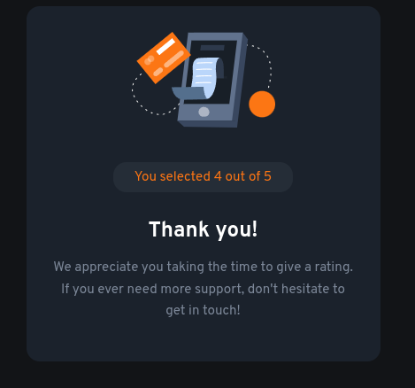

# Frontend Mentor - Interactive rating component solution

This is a solution to the [Interactive rating component challenge on Frontend Mentor](https://www.frontendmentor.io/challenges/interactive-rating-component-koxpeBUmI). Frontend Mentor challenges help you improve your coding skills by building realistic projects. 

## Table of contents

- [Overview](#overview)
  - [The challenge](#the-challenge)
  - [Screenshot](#screenshot)
  - [Links](#links)
- [My process](#my-process)
  - [Built with](#built-with)
  - [What I learned](#what-i-learned)
  - [Continued development](#continued-development)
  - [Useful resources](#useful-resources)
- [Author](#author)
- [Acknowledgments](#acknowledgments)

**Note: Delete this note and update the table of contents based on what sections you keep.**

## Overview

### The challenge

Users should be able to:

- View the optimal layout for the app depending on their device's screen size
- See hover states for all interactive elements on the page
- Select and submit a number rating
- See the "Thank you" card state after submitting a rating

### Screenshot

### Links

- Solution URL: [Add solution URL here](https://your-solution-url.com)
- Live Site URL: [Add live site URL here](https://your-live-site-url.com)

## My process

### Built with

- Semantic HTML5 markup
- CSS custom properties
- Flexbox
- Templates and slots

**Note: These are just examples. Delete this note and replace the list above with your own choices**

### What I learned

I learned how to style inputs of type radio, as well as how to use templates and slots.

### Continued development

### Useful resources

- [Customize Radio Buttons without Compromising Accessibility](https://blog.bitsrc.io/customise-radio-buttons-without-compromising-accessibility-b03061b5ba93) - This helped me style radio buttons to look like rating buttons
- [Options for styling web components](https://nolanlawson.com/2021/01/03/options-for-styling-web-components/) - This helped me style the Thank You web component

## Author

- Website - [Daniel](https://coldfix.dev)
- Frontend Mentor - [@dXu23](https://www.frontendmentor.io/profile/dXu23)

**Note: Delete this note and add/remove/edit lines above based on what links you'd like to share.**

## Acknowledgments

